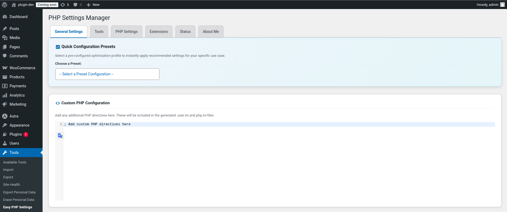
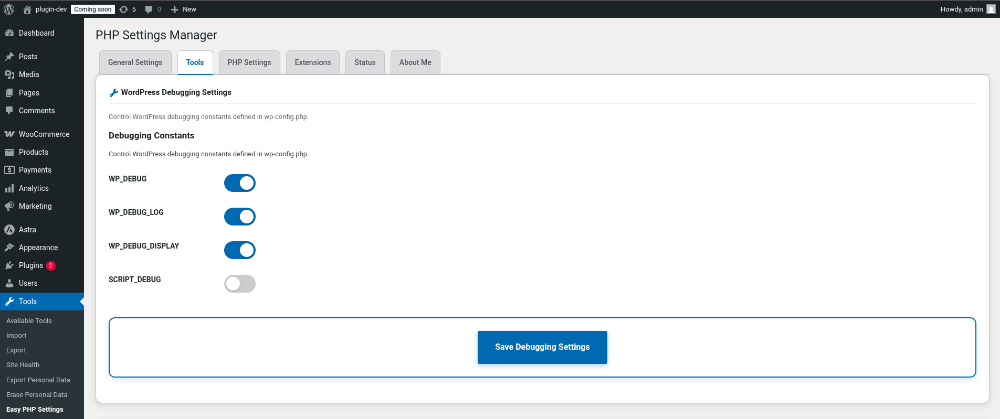
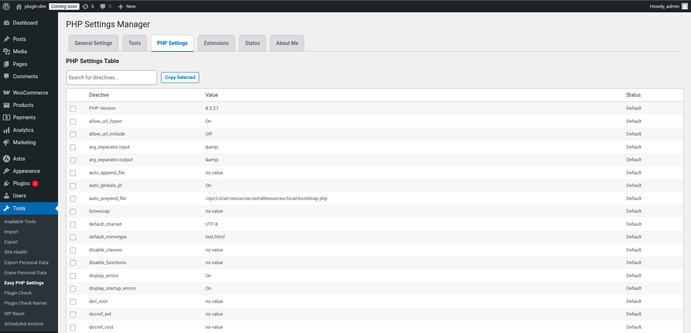
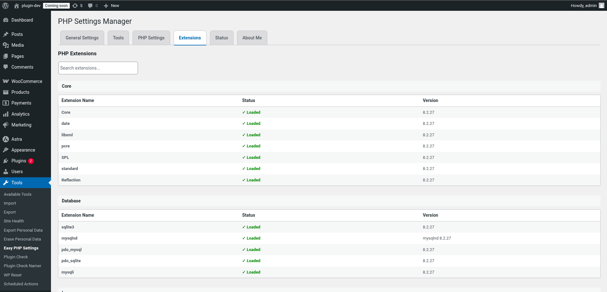
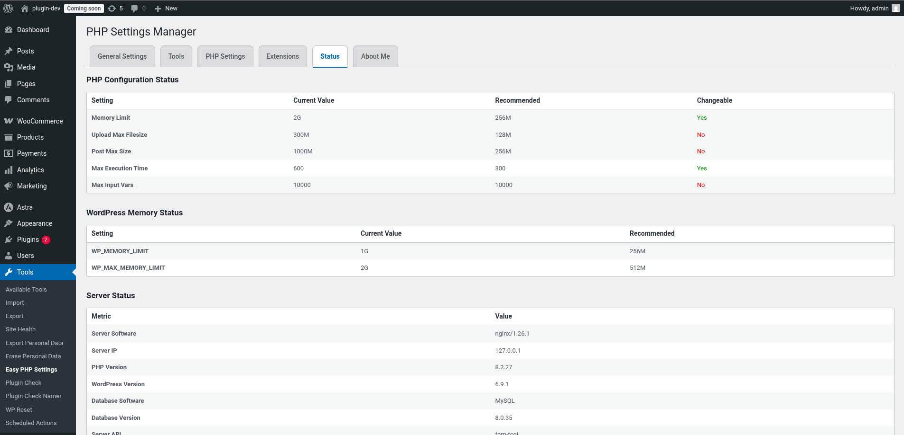
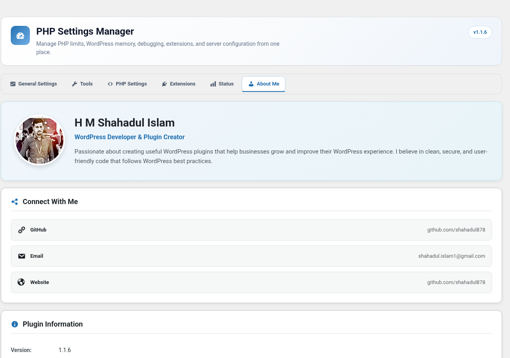

# Easy PHP Settings

[](https://wordpress.org/plugins/easy-php-settings/)
[](https://wordpress.org/plugins/easy-php-settings/)
[](https://www.gnu.org/licenses/gpl-2.0.html)
[](https://php.net)
[](https://wordpress.org)

Manage PHP INI settings and WordPress debugging constants directly from the WordPress admin panel — no file editing required.

## Screenshots

| General Settings | Tools | PHP Settings |
|:---:|:---:|:---:|
|  |  |  |

| Extensions | Status | About |
|:---:|:---:|:---:|
|  |  |  |

## Features

- **Core PHP Settings** — Modify `memory_limit`, `upload_max_filesize`, `post_max_size`, `max_execution_time`, and `max_input_vars`
- **Custom php.ini** — Add any PHP directives (sessions, timezone, logging, etc.) via a flexible textarea
- **Quick Presets** — One-click profiles: Default, Performance, WooCommerce, Development, Large Media
- **WordPress Memory** — Configure `WP_MEMORY_LIMIT` and `WP_MAX_MEMORY_LIMIT`
- **Auto Config Files** — Generates `.user.ini` and `php.ini` on save
- **Config Generator** — Produces snippets for locked-down environments
- **PHP Extensions** — Categorized viewer with missing extension alerts
- **Debugging Toggles** — Control `WP_DEBUG`, `WP_DEBUG_LOG`, `WP_DEBUG_DISPLAY`, `SCRIPT_DEBUG`
- **Import / Export** — Backup and migrate settings as JSON
- **One-Click Reset** — Restore recommended or server default values
- **Settings Validation** — Warns about problematic values before saving
- **Live Status** — Compare current vs. recommended PHP values
- **Multisite Ready** — Network-level settings for Super Admins

## Requirements

| Requirement | Version |
|-------------|---------|
| WordPress | 5.0+ |
| PHP | 7.2+ |
| Tested up to | 6.9 |

## Installation

### From WordPress.org

1. Go to **Plugins > Add New** in your WordPress admin
2. Search for **Easy PHP Settings**
3. Click **Install Now**, then **Activate**

### Manual Upload

1. Download the plugin ZIP from [WordPress.org](https://wordpress.org/plugins/easy-php-settings/) or [GitHub Releases](https://github.com/shahadul878/easy-php-settings/releases)
2. Go to **Plugins > Add New > Upload Plugin**
3. Upload the ZIP and activate

### From Source

```bash
cd wp-content/plugins/
git clone https://github.com/shahadul878/easy-php-settings.git
```

Activate via **Plugins** in the WordPress admin.

## Usage

Navigate to **Tools > Easy PHP Settings** in the WordPress admin (or **Network Admin > Settings > PHP Settings** on multisite).

| Tab | Purpose |
|-----|---------|
| **General Settings** | Configure PHP values, presets, WordPress memory, and generate config files |
| **Tools** | Toggle debugging constants, view logs, export/import settings, reset |
| **PHP Settings** | Browse all PHP directives in a searchable, copyable table |
| **Extensions** | View loaded PHP extensions by category |
| **Status** | Compare current vs. recommended PHP and memory values |
| **About** | Plugin info, author, and support links |

## Project Structure

```
easy-php-settings/
├── class-easy-php-settings.php    # Main orchestrator (~380 lines)
├── readme.txt                     # WordPress.org readme
├── css/                           # Admin stylesheets
├── js/                            # Admin scripts
├── languages/                     # i18n translation files
├── view/                          # PHP view templates
├── modules/                       # Self-contained feature modules
│   ├── class-module-general-settings.php
│   ├── class-module-tools.php
│   ├── class-module-php-settings.php
│   ├── class-module-extensions.php
│   ├── class-module-status.php
│   └── class-module-about.php
├── includes/                      # Core classes
│   ├── class-easy-module-base.php
│   ├── class-easy-module-manager.php
│   ├── class-easy-module-loader.php
│   ├── class-easy-config-parser.php
│   ├── class-easy-config-backup.php
│   ├── class-easy-error-handler.php
│   ├── class-easy-settings-validator.php
│   ├── class-easy-settings-cache.php
│   ├── class-easy-settings-history.php
│   ├── class-easy-extensions-viewer.php
│   ├── class-easyinifile.php
│   └── class-easyphpinfo.php
├── .github/workflows/             # CI/CD
│   ├── deploy-to-wordpress-org.yml
│   ├── deploy-assets.yml
│   └── validate.yml
└── .wordpress-org/                # WordPress.org page assets
    ├── banner-*.png
    ├── icon-*.png
    └── screenshot-*.png
```

## Architecture

The plugin uses a **modular architecture**:

- **`Easy_PHP_Settings`** — Slim orchestrator that bootstraps the module system, defines shared data, and manages the admin menu/tab framework
- **`Easy_Module_Manager`** — Discovers, registers, and coordinates modules
- **`Easy_Module_Base`** — Abstract base class that every module extends
- **Modules** — Each tab is a self-contained module owning its own settings registration, rendering, validation, and action handling

## Contributing

Contributions are welcome! Please follow these steps:

1. Fork the repository
2. Create a feature branch: `git checkout -b feature/my-feature`
3. Commit your changes: `git commit -m "Add my feature"`
4. Push to the branch: `git push origin feature/my-feature`
5. Open a Pull Request

### Development Guidelines

- Follow [WordPress Coding Standards](https://developer.wordpress.org/coding-standards/)
- Test on both single-site and multisite
- Ensure PHP 7.2+ compatibility
- Run `php -l` syntax checks before committing

## Changelog

See [readme.txt](readme.txt) for the full changelog.

### Latest — v1.1.0 (March 5, 2026)

- Complete modular architecture refactor
- Main plugin file reduced from 2,000+ to ~380 lines
- 6 self-contained feature modules
- Cleaned up legacy code, duplicates, and empty directories
- Updated CI/CD workflows

## License

This project is licensed under the [GPLv2 or later](https://www.gnu.org/licenses/gpl-2.0.html).

## Author

**H M Shahadul Islam**
- GitHub: [@shahadul878](https://github.com/shahadul878)
- Email: shahadul.islam1@gmail.com

---

If you find this plugin useful, please [leave a review on WordPress.org](https://wordpress.org/support/plugin/easy-php-settings/reviews/#new-post) or [star the repo on GitHub](https://github.com/shahadul878/easy-php-settings).
